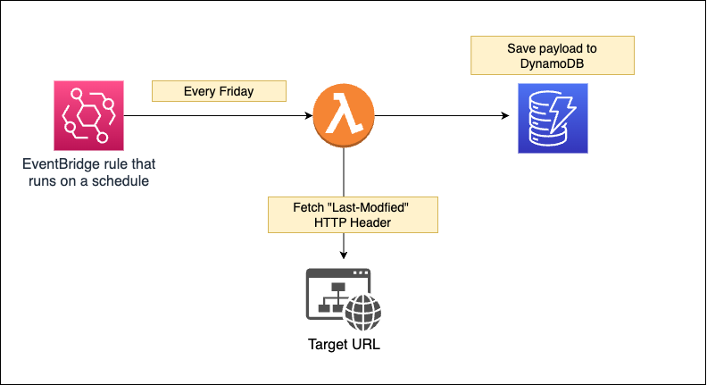

# EventBridge Scheduled Rule to check "Last-Modified" header of a URL

This project contains a CDK template that creates a rule that
runs on a schedule every Friday at 07:00 am. It triggers a lambda to fetch the "Last-Modified" header of a URL and check if the header is older than the specified number of days (e.g., "older than 30 days ago"). The default value is 30 days. Finally, a payload object is created:

```js
const payload = {
  url: TARGET_URL,
  lastModified: lastModified,
};

if (date < daysAgo) {
  payload.expired = true;
}
```

If the header value is older than the specified number of days, a property `expired` is added to the payload object and is saved to DynamoDB.

If the header is not older than the specified number of days, the property `expired` is not added to the payload object and is saved to DynamoDB.

### Final architecture:


